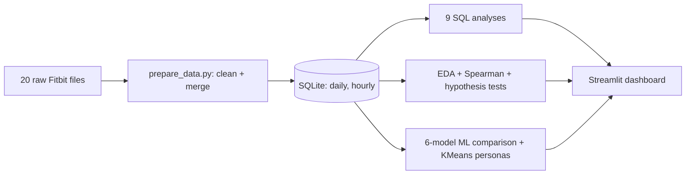

# 🌙 Fitbit Recovery Lab
Streamlit dashboard + SQL analysis on Fitbit data (33 users, 12 Apr–12 May 2016). Question: **does movement help or hurt recovery (sleep, heart rate)?**

## Setup
```bash
pip install -r requirements.txt
streamlit run app.py          # builds data/fitbit.db automatically on first run
```
Deploy free: push this folder to GitHub → share.streamlit.io → main file `app.py`.

## Workflow


## Structure
| Path | Purpose |
|---|---|
| `app.py` | Streamlit UI (6 tabs) |
| `src/db.py` | SQLite build + validated, read-only query runner |
| `src/queries.py` | 9 named SQL analyses (CTEs, CASE, LAG, RANK) |
| `src/analysis.py` | Stats tests, correlations, ML, personas |
| `src/prepare_data.py` | Raw → clean → merged CSVs (put raw files in `data/raw/`) |

## Methodology
- **Cleaning:** removed 3 + 543 duplicate sleep rows; parsed datetimes; dropped redundant wide/daily files (identical to narrow/dailyActivity); METs ÷ 10; heart rate (seconds) aggregated to minute/hour/day; `Fat` dropped (97% missing).
- **Missing values:** sleep (57% of user-days), heart rate (64%), weight (93%) are *not* imputed for statistics — analyses use rows where the variable exists. ML pipelines use median imputation inside cross-validation (no leakage). See Overview tab.
- **Non-wear days:** 72 days with 0 steps + 1440 sedentary minutes are flagged and excluded by default (sidebar toggle).
- **Stress/anxiety proxies:** Fitbit has none; sleep duration/efficiency and minimum heart rate are used as recovery proxies.
- **Stats:** Mann-Whitney U, Kruskal-Wallis, Spearman (skewed data) with effect sizes.
- **ML:** predict sleep ≥ 7 h from same-day activity; 6 models incl. majority baseline; StratifiedGroupKFold by user; metrics accuracy / F1 / ROC-AUC. `SedentaryMinutes` excluded (contains sleep time → leakage).
- **Robustness:** SQL editor is SELECT-only and runs on a read-only connection; slider inputs are bounded; every tab handles errors gracefully.

## Limitations
Small sample, pooled user-days (optimistic p-values), sleep/HR/weight cover subsets of users, observational data (no causality).

## Notebook
`EDA_Notebook.ipynb` — standalone EDA (overview, missing values, outliers, univariate, bivariate, correlations, tests, daily rhythm, insights). Run from the project root.
